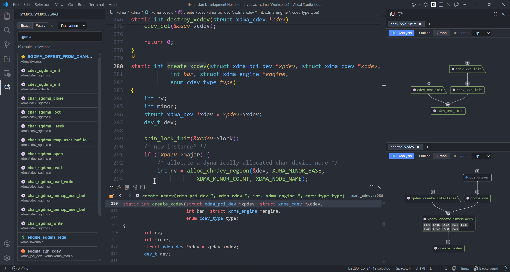

# Peek and Map

一个 **"99%AI + 1%Idea"** 的 VS Code 插件，实现了 **Peek View**、**Map View** 和 **Symbol Search** 三个视图，提供类似source insight的部分体验。

- **Peek View**：实时展示光标处符号的定义体，跟随编辑器语法高亮、支持视图内跳转、前进后退导航、锁定跟随和快速字体调整。
- **Map View**：分析光标处符号的引用关系，支持 `Outline` / `Graph` 两种视图；`Graph` 支持上下左右四个生长方向，支持递归展开和跳转。
- **Symbol Search**：在工作区内按关键字搜索符号（支持空格分隔多关键字 AND 匹配），输入时实时刷新结果列表；默认单击仅更新 Peek，双击跳转到定义位置（单击行为可配置）。

---

## 效果预览

---

## 功能列表

### Peek View

| 功能 | 说明 |
| ---- | ---- |
| **显示光标处符号的定义** | 光标选中符号时，自动展示该符号的**定义体**（函数/方法/类/结构体/宏等等）。 |
| **实时跟随光标** | 光标在编辑器中移动时，视图内容自动刷新。 |
| **当前行高亮** | Peek 视图内高亮当前定位行，便于快速识别定义位置。 |
| **保持上次内容** | 光标移到空白、注释或无法解析定义的位置时，视图保持上一次的显示内容不变，避免频繁闪烁。 |
| **语法高亮** | 基于本地 Prism.js，支持 TypeScript、Python、C/C++、Go、Rust、Java、C# 等 30+ 种语言。 |
| **继承编辑器主题配色** | 自动读取当前 VS Code 主题（包括第三方主题）的 `tokenColors`，将 TextMate scope 映射到 Prism token，语法高亮颜色与编辑器完全一致；但是切换主题时还不能及时自动更新，可能要重启vscode。 |
| **编辑器代码跳转** | 在视图中双击空白区域或单击行号，编辑器即跳转到对应位置；双击代码文本仅选中文本。 |
| **视图内跳转** | 在视图中按住 Ctrl 并点击函数/类型/宏等符号，直接在 Peek 视图内跳转到该符号的定义，无需离开视图。 |
| **前进/后退导航** | Ctrl+点击跳转后可通过**视图内**左上角按钮或鼠标侧键在历史记录中切换。 |
| **锁定跟随** | 前进/后退按钮左侧提供锁定按钮；锁定后 Peek 不再响应编辑器光标变化，但仍可在视图内 Ctrl+点击跳转并使用前进/后退。 |
| **快速缩放字体** | 按住 Ctrl 并滚动鼠标滚轮可调整视图字体大小（8–40px），缩放时当前可见的第一行保持不变；设置会自动持久化。 |
| **符号类型图标** | 顶栏符号左侧显示彩色 Emoji 图标（按字母序：🗂️ Array、⚖️ Boolean、📱 Class、⭐ Constant、📲 Constructor、🏷️ Enum、🔖 EnumMember、🎯 Event、🟠 Field、📄 File、💿 Function、🔵 Global、🔗 Interface、🗝️ Key、📀 Method、📦 Module、📃 Namespace、⭕ Null、🔢 Number、🧰 Object、➗ Operator、🗃️ Package、🟢 Property、🧵 String、💲 Struct、🧬 TypeParameter、🔷 Variable）和符号名称，颜色继承自当前 VS Code 主题。 |

### Map View

| 功能 | 说明 |
| ---- | ---- |
| **双模式视图切换** | 使用 `Outline` / `Graph` 标签切换视图；`Graph` 模式支持方向选择（`Right` / `Left` / `Up` / `Down`）。 |
| **引用分析** | 在编辑器中选中符号，点击「Analysis」按钮后，展示当前符号的引用情况，按符号去重；递归展开时按“当前路径”去重，避免同一路径中重复出现已访问节点（防止无线套娃）。 |
| **声明/定义规则** | 当分析目标是函数声明时，会过滤“该声明被其对应定义引用”的回跳关系；声明仍可被其他函数正常引用并展开。 |
| **根节点入图/入树** | 当前分析符号不再显示在顶栏，而是直接作为根节点显示在树形与图形视图中，交互与其他节点一致。 |
| **懒加载树展开** | 树节点支持点击 SVG 箭头递归加载子引用，已展开节点可折叠/展开无需重新请求。 |
| **单击/双击行为可配置** | 默认单击树节点在 Peek View 中预览定义、双击在编辑器中打开并定位；可通过 `mapView.singleClickAction` 将单击改为“预览+打开编辑器”。 |
| **图形视图（Graph）** | 图形视图以 BFS 树布局展示符号关系，Bezier 曲线连边；普通节点为圆角矩形，函数声明节点使用直角梯形边框；通过符号名前的彩色 Emoji 图标区分对象类型。|
| **图形视图节点合并** | 当同一符号在多处引用目标符号时，图形视图中自动将重复的节点合并为一个，节点内部以行号徽章（如 `L10` `L20` `L30`）展示所有调用位置；单击/双击不同行号徽章分别触发预览/跳转到对应的调用位置，与树形视图中对应节点的行为一致。 |
| **图形视图交互** | 默认单击节点在 Peek View 中预览（preserveFocus）、双击在编辑器中打开；可通过 `mapView.singleClickAction` 调整单击行为。点击节点侧边 `+/-` 按钮展开/折叠子节点、拖拽平移；若某节点尝试展开后无子节点，其侧边按钮会变为空心圆提示“无可展开内容”；滚轮默认上下平移，`Shift+滚轮` 左右平移，鼠标滚轮左右拨动可左右平移，`Ctrl+滚轮` 缩放；等待动画显示在节点延伸方向（上/下/左/右）。 |
| **视图状态持久化** | Map 视图会保存并恢复上次状态：`Outline/Graph` 模式以及 Graph 的方向设置。 |
| **折叠状态恢复** | 折叠靠近根部节点时会保留其后代展开状态；重新展开后自动恢复已展开子节点。 |

### Symbol Search

| 功能 | 说明 |
| ---- | ---- |
| **工作区符号搜索** | 基于 VS Code Workspace Symbol Provider 在整个工作区检索符号。 |
| **实时更新结果** | 在搜索框输入时自动触发查询并刷新结果列表（有短暂延时防抖处理）。 |
| **多关键字匹配** | 支持空格分隔的多关键字查询（AND 关系）；仅展示同时匹配所有关键字的符号（匹配范围：符号名 / 容器名 / 类型名）。 |
| **搜索模式切换** | 在搜索框上方提供 `Exact` / `Fuzzy` 标签，默认 `Exact`；切换后立即按对应模式查询。 |
| **排序方式切换** | 在搜索模式右侧提供下拉框，支持 `Relevance`、`Name (A-Z)`、`Name (Z-A)`、`Kind`、`Path`。 |
| **模式持久化** | `Exact/Fuzzy` 与排序方式会被持久化，重新打开工作区后自动恢复。 |
| **快速定位（可配置）** | 默认单击结果仅更新 Peek，双击打开目标文件并定位；可通过 `symbolSearch.singleClickAction` 将单击改为“预览+打开编辑器”。 |
| **结果信息** | 列表展示符号图标（emoji）、符号名、容器名和相对路径。 |

---

## 配置项

| 配置键 | 类型 | 默认值 | 说明 |
| ---- | ---- | ---- | ---- |
| `peekView.fontSize` | number | 13 | Peek 视图字体大小（px）。 |
| `peekView.contextPadding` | number | 30 | 在符号定义体**上方和下方**各额外显示的行数（范围 0–500）；设置大范围方便查看更多上下文，设置 0 则仅显示选中的符号定义。 |
| `peekView.historyCacheLimit` | number | 15 | Peek 视图环形历史缓存容量（范围 5–50）；光标更新与视图内跳转都会写入，容量满时覆盖最旧记录。 |
| `mapView.wheelPanSensitivity` | number | 1 | Map 图形视图中滚轮滚动平移灵敏度（普通滚轮上下平移与 `Shift+滚轮` 左右平移）。 |
| `mapView.wheelTiltPanSensitivity` | number | 0.3 | Map 图形视图中鼠标滚轮左右拨动（水平滚轮）平移灵敏度。 |
| `mapView.singleClickAction` | string | `peekOnly` | Map 视图节点单击行为：`peekOnly`（仅更新 Peek）或 `jumpTo`（同时更新 Peek 和编辑器）。 |
| `symbolSearch.singleClickAction` | string | `peekOnly` | Symbol Search 结果单击行为：`peekOnly`（仅更新 Peek）或 `jumpTo`（同时更新 Peek 和编辑器）。 |

---
## 使用建议
- 在vscode的设置里，将[editor.hover.enabled](vscode://settings/editor.hover.enabled)选项配置成off或者onKeyboardModifier，防止自带的弹窗干扰视线；

---

## 支持的语言

TypeScript · JavaScript · TSX · JSX · Python · Java · C · C++ · C# · Go · Rust · Ruby · PHP · Swift · Kotlin · HTML · XML · CSS · SCSS · Less · JSON · YAML · Markdown · Bash/Shell · PowerShell · Lua · R · Dart · Scala · Groovy · Perl

仅在c/cpp做了一定程度的测试，其他语言实际体验暂时不敢保证。
不在上述列表中的语言回退到通用 `clike` 高亮。

---

## 已知限制

- 需要对应语言的扩展提供 `DocumentSymbolProvider`。纯文本文件或小众语言会显示「当前语言暂不支持符号解析」。
- 主题配色映射基于 TextMate scope → Prism token 的静态映射表，极少数自定义 scope 可能无法覆盖，此时回退到编辑器前景色。

---

## TODO

- map 视图考虑不再根据编辑器主题变化，只提供视觉效果较好的明亮/黑暗两套配色。

---

## License

MIT © 2026 — 详见 [LICENSE](LICENSE)

---

## 更多文档

- [**项目结构**](ARCHITECTURE.md) — 源代码目录、模块职责和各文件的函数说明
- [**工作原理与运行调试**](CONTRIBUTING.md) — 整体流程图、主题配色继承、关键设计决策、构建与调试指南
